# 基于springboot的党员教育和管理系统

<h4 style='color:red'>联系不到我，就看我的主页 </h4> 
 
#### 介绍

随着党组织的不断发展壮大，对党员的教育和管理工作提出了更高的要求。为了提高党员教育管理的效率和质量，加强党组织的规范化建设，我们开发了这套基于 Spring Boot 的党员教育和管理系统，旨在为党组织提供一个便捷、高效、全面的信息化管理平台。

#### 技术栈

后端技术栈：Springboot+Mysql+Maven

前端技术栈：Vue+Html+Css+Javascript+ElementUI

开发工具：Idea+Vscode+Navicate

#### 系统功能介绍

（一）管理端  
个人中心：管理端人员可以在此查看和修改个人信息，接收系统通知和重要消息。  
管理员管理：对系统中的其他管理员进行添加、删除、修改权限等操作，确保管理团队的合理配置和有效运作。  
党费登记管理：负责记录党员的党费缴纳情况，包括缴纳金额、缴纳时间、缴费方式等，便于对党费的收支进行统计和管理。  
基础数据管理：对系统中的基础数据进行维护和管理，如党组织架构、党员信息字段设置、行政区划等。  
奖惩记录管理：记录党员的奖励和处分情况，为党员的考核和评价提供依据。  
基层单位管理：对所属的基层党组织单位进行管理，包括单位信息的录入、修改、删除等。  
公告管理：发布和管理面向全体党员和支部的公告信息，确保重要通知和政策能够及时传达。  
党员管理：对党员的基本信息、组织关系、发展状态等进行全面管理。  
支部管理：对各个党支部的信息、组织架构、负责人等进行管理和维护。  
支部日志管理：查看和审核各支部的工作日志，了解支部活动开展情况和工作进展。  
支部荣誉管理：记录和管理支部所获得的荣誉和表彰情况，展示支部的工作成果。  

（二）支部端  
个人中心：支部相关人员可在此查看个人信息和工作相关数据。  
党费登记管理：登记本支部党员的党费缴纳情况，并进行汇总和上报。  
奖惩记录管理：记录本支部党员的奖惩情况，作为支部内部考核的依据。  
基层单位管理：对本支部所属的基层单位信息进行维护和更新。  
公告管理：接收和查看上级发布的公告，并向本支部党员传达重要信息。  
党员管理：管理本支部党员的详细信息，包括党员的学习情况、参与活动情况等。  
支部管理：对本支部的组织架构、工作计划、活动安排等进行管理和调整。  
支部日志管理：记录支部的日常工作和活动情况，形成工作日志。  
支部荣誉管理：申报和管理本支部所获得的荣誉，激励支部成员积极进取。  

（三）党员端  
个人中心：党员可以查看和修改个人的基本信息、学习记录等。  
党费登记管理：查看自己的党费缴纳记录，及时进行缴纳。  
奖惩记录管理：了解自身的奖惩情况，激励自己遵守纪律、积极表现。  
公告管理：接收党组织发布的公告，及时了解组织的最新动态和工作要求。  
党员管理：查看个人在党组织中的信息和状态。  
支部管理：了解所在支部的基本情况和组织架构。  
支部日志管理：查看支部的工作日志，了解支部的活动和工作进展。  
支部荣誉管理：为支部获得的荣誉感到自豪，增强集体荣誉感和归属感。  

#### 系统作用

提高管理效率  
实现了党员信息、支部信息等数据的集中管理和快速查询，大大减轻了管理人员的工作负担，提高了工作效率。  
规范教育管理流程  
对党费缴纳、奖惩记录、公告发布等工作进行了规范化的流程设计，确保各项工作有序进行。  
增强党员教育效果  
通过系统可以及时推送学习资料、组织在线学习和考试等，丰富了党员教育的形式和内容。  
促进党组织建设  
加强了支部之间、党员之间的沟通和交流，有利于党组织凝聚力和战斗力的提升。  
提供决策支持  
系统所积累的数据为党组织的决策提供了有力的依据，有助于制定更加科学合理的发展策略。  

#### 系统功能截图

代码结构

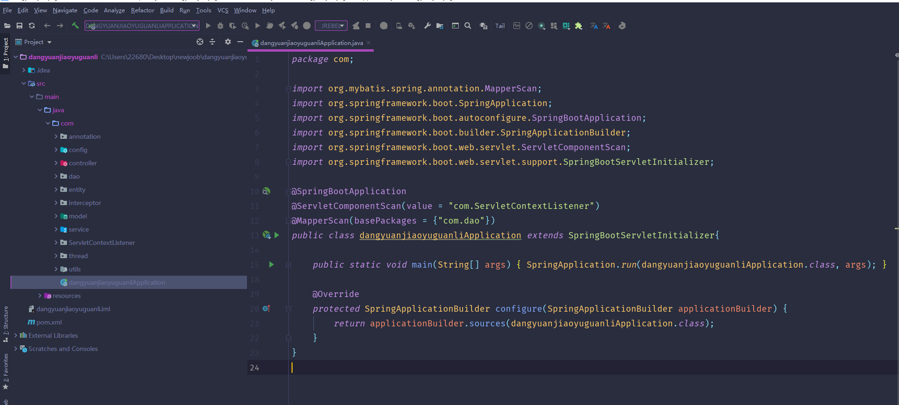

数据库表

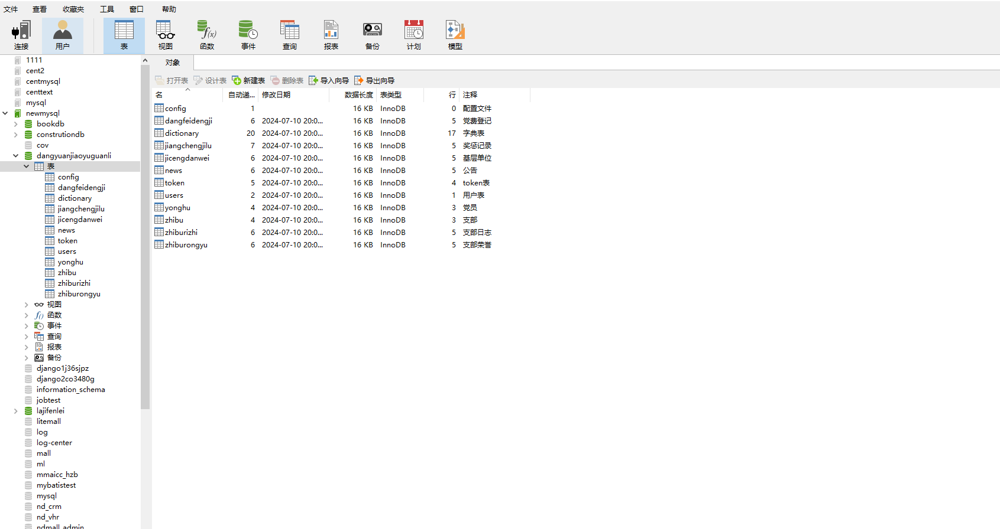

登录

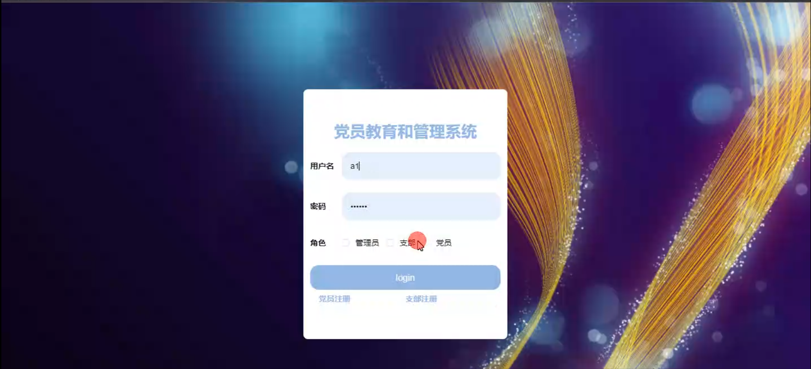

党员端个人中心

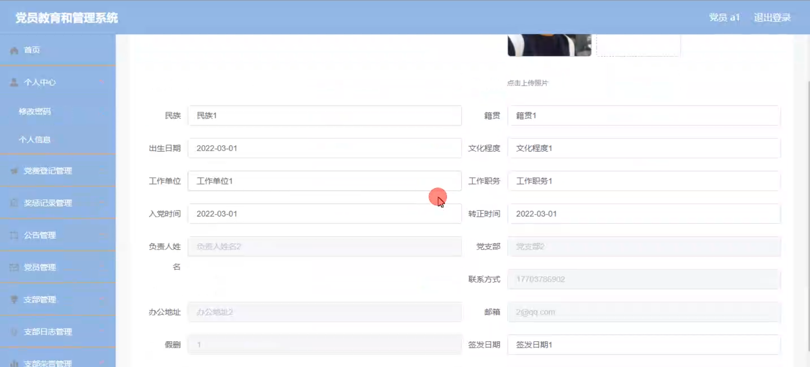

党费登记管理

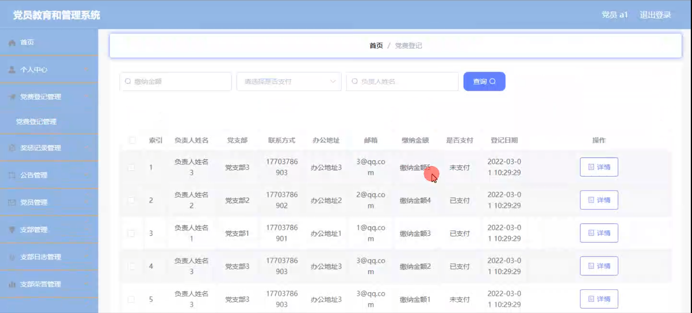

奖惩记录管理

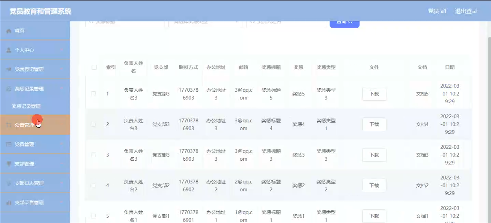

公告管理

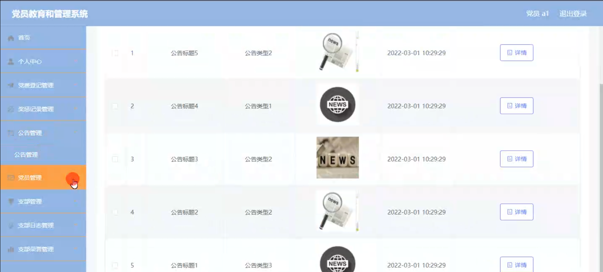

支部管理

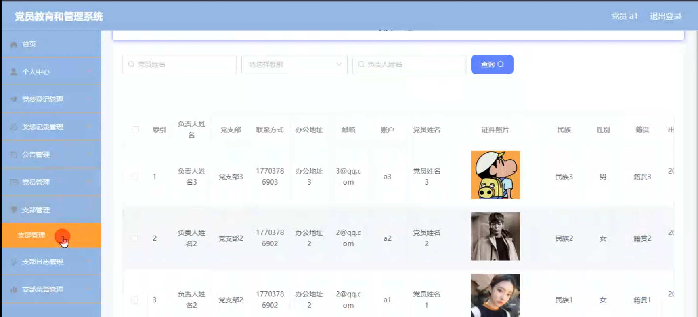

支部荣誉管理

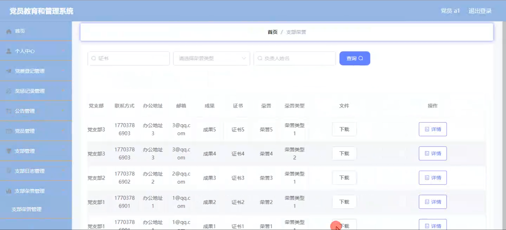

支部端基层单位管理

党员管理

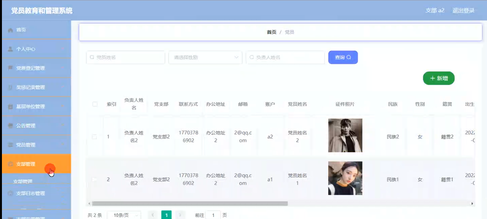

管理员端荣誉类型管理

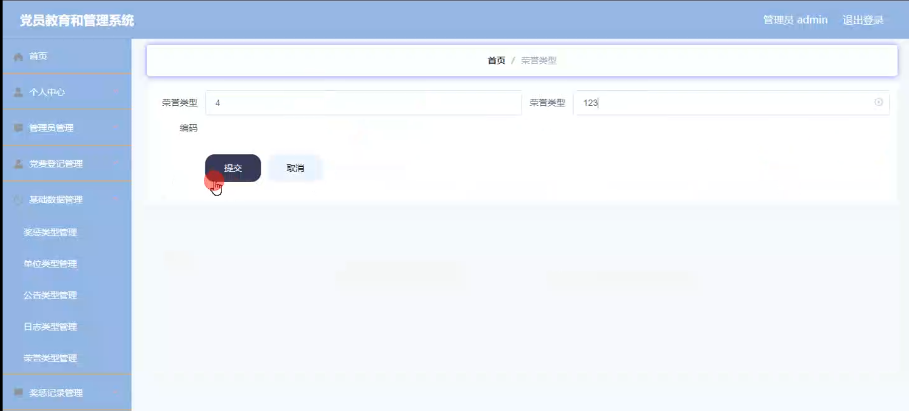

#### 总结

基于 Spring Boot 的党员教育和管理系统，通过明确管理端、支部端和党员端的功能职责，实现了党员教育管理工作的信息化、规范化和科学化。该系统为党组织提供了强大的工具，有助于提高党员素质，加强党组织建设，推动党的事业不断发展。

#### 使用说明

创建数据库，执行数据库脚本 修改jdbc数据库连接参数 下载安装maven依赖jar 启动idea中的springboot项目

后台登录页面
http://localhost:8080/dangyuanjiaoyuguanli/admin/dist/index.html

管理员				账户:admin 		密码：admin

党员				账户:a1 		密码：123456

支部				账户:a2 		密码：123456